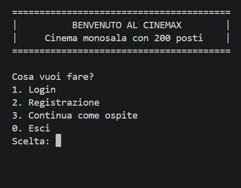
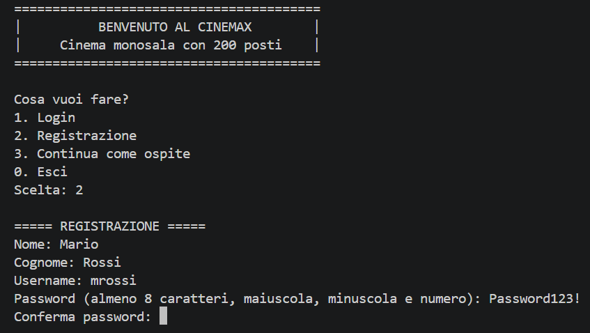
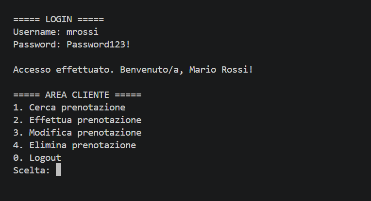

# Università degli Studi dell'Insubria
## Dipartimento di Scienze Teoriche e Applicate

# CineMax
## Manuale Utente

**Autori:**
- Donato Edoardo, 767352, VA
- Gentile Giorgio, 759951, VA
- Fejzaj Cristina, 761382, VA

**Versione documento:** 1.0
**Data:** 28/08/2026

---

## Indice

1. Installazione
   1. Requisiti di sistema
   2. Setup ambiente
   3. Installazione programma
2. Esecuzione ed uso
   1. Setup e lancio del programma
   2. Uso delle funzionalità
   3. Dataset di test
3. Limiti della soluzione sviluppata
4. Sitografia / Bibliografia

---

## 1. Installazione

### 1.1 Requisiti di sistema

Per eseguire CineMax è necessario avere installato sul proprio computer:

- **Java Development Kit (JDK) versione 25 o superiore** — il programma è stato sviluppato e testato con questa versione
- Sistema operativo Windows, macOS o Linux (compatibile con qualsiasi sistema che supporti Java)
- Almeno 50 MB di spazio libero su disco per il programma e i file di dati

Per verificare se Java è già installato sul proprio computer, aprire un terminale e digitare il seguente comando:

    java -version

Se il comando restituisce un numero di versione, Java è già installato. In caso contrario, è necessario scaricarlo dal sito ufficiale di Oracle (https://www.oracle.com/java/technologies/downloads/) o da un'altra distribuzione OpenJDK.

---

### 1.2 Setup ambiente

CineMax utilizza una libreria esterna, **jbcrypt**, per la gestione sicura delle password. Il file della libreria (`jbcrypt-0.4.jar`) è già incluso nella cartella `lib/` del repository, non è necessario scaricarlo separatamente.

Per compilare o eseguire il codice sorgente, è necessario includere il percorso della libreria nel classpath (vedere la sezione 2.1 "Setup e lancio del programma").

---

### 1.3 Installazione programma

Per installare CineMax sul proprio computer:

1. Scaricare il codice del progetto dal repository GitHub, disponibile all'indirizzo:
   `https://github.com/Edonato23/cinemax`

2. È possibile scaricare il progetto in due modi:
   - **Tramite Git**: aprire un terminale nella cartella desiderata ed eseguire:

         git clone https://github.com/Edonato23/cinemax.git

   - **Senza Git**: sulla pagina del repository, cliccare sul pulsante verde "Code" e selezionare "Download ZIP", quindi estrarre l'archivio in una cartella a scelta

3. Una volta scaricato, il programma è pronto per l'esecuzione (vedere la sezione 2.1 "Setup e lancio del programma")

---

## 2. Esecuzione ed uso

### 2.1 Setup e lancio del programma

**Se si dispone del file eseguibile (.jar)**, presente nella cartella `bin/` del progetto, è sufficiente aprire un terminale nella cartella del progetto ed eseguire:

    java -jar bin/cinemax.jar

**Se invece si desidera compilare il codice sorgente**, aprire un terminale nella cartella principale del progetto (quella contenente le cartelle `src`, `data`, `bin`, `lib`) ed eseguire, nell'ordine:

1. Compilazione:

       javac -cp lib/jbcrypt-0.4.jar -d bin src/cinemax/*.java

2. Esecuzione:

       java -cp "bin;lib/jbcrypt-0.4.jar" cinemax.CineMax

Il programma mostrerà a schermo il menu principale, da cui è possibile scegliere tra Login, Registrazione o continuare come ospite.

---

### 2.2 Uso delle funzionalità

All'avvio, il programma mostra il menu principale, da cui è possibile scegliere tra quattro opzioni:

- **Login**: per accedere con un account già registrato (Cliente, Proiezionista o Bigliettaio)
- **Registrazione**: per creare un nuovo account
- **Continua come ospite**: per consultare le proiezioni disponibili senza registrarsi
- **Esci**: per chiudere il programma

Per selezionare un'opzione, digitare il numero corrispondente e premere Invio.

---

**Registrazione di un nuovo account**

Selezionando l'opzione "2. Registrazione", il programma richiede in sequenza i dati necessari per creare un nuovo account: nome, cognome, username (deve essere univoco) e password.

La password deve rispettare i seguenti requisiti:
- Almeno 8 caratteri
- Almeno una lettera maiuscola
- Almeno una lettera minuscola
- Almeno un numero

Dopo aver confermato la password, il programma richiede anche la data di nascita (facoltativa) e il domicilio, e infine chiede di scegliere il ruolo con cui registrarsi: Cliente, Proiezionista o Bigliettaio. Al termine, viene mostrato un messaggio di conferma e sarà possibile effettuare il login con le credenziali appena create.

---

**Accesso e Area Cliente**

Selezionando "1. Login" dal menu principale, e inserendo username e password corretti, si accede alla propria area personale. Il ruolo scelto in fase di registrazione determina quale menu viene mostrato.

Per un utente registrato come **Cliente**, l'area personale offre le seguenti funzionalità:

- **Cerca prenotazione**: consente di visualizzare i dettagli di una prenotazione già effettuata
- **Effettua prenotazione**: permette di scegliere una proiezione disponibile e prenotare uno o più posti
- **Modifica prenotazione**: consente di cambiare proiezione o numero di posti di una prenotazione esistente
- **Elimina prenotazione**: cancella una prenotazione già effettuata
- **Logout**: torna al menu principale

---

### 2.3 Dataset di test

Il progetto include un dataset di proiezioni di esempio, fornito dal docente del corso, situato in `data/proiezioni.csv`. Il file contiene 8878 proiezioni cinematografiche, con i seguenti campi per ciascuna: identificativo, data e ora, titolo del film, genere, regista, anno di uscita, durata in minuti, età minima consigliata e prezzo del biglietto.

Questo dataset viene caricato automaticamente all'avvio del programma e utilizzato per popolare l'elenco delle proiezioni disponibili, permettendo di testare tutte le funzionalità (ricerca, prenotazione, ecc.) senza dover inserire manualmente i dati.

Allo stesso modo, i file `data/utenti.csv` e `data/prenotazioni.csv` vengono creati e aggiornati automaticamente dal programma man mano che vengono registrati nuovi utenti ed effettuate nuove prenotazioni.

---

## 3. Limiti della soluzione sviluppata

La soluzione sviluppata presenta alcuni limiti, dovuti alle scelte di design adottate per il progetto:

- **Interfaccia a riga di comando**: il programma non dispone di un'interfaccia grafica; tutte le interazioni avvengono tramite testo digitato da tastiera.
- **Singola sala cinematografica**: il sistema è progettato per gestire un unico cinema con una sola sala da 200 posti, senza possibilità di gestire più sale o cinema multipli.
- **Persistenza su file di testo**: i dati vengono salvati in file CSV anziché in un database relazionale. Questo comporta che il sistema non è pensato per gestire accessi concorrenti di più utenti/istanze del programma contemporaneamente sugli stessi file.
- **Nessuna gestione di pagamenti reali**: il sistema calcola il totale della prenotazione ma non prevede un'integrazione con sistemi di pagamento effettivi.

---

## 4. Sitografia / Bibliografia

- Oracle, *Java SE Documentation*, Online: https://docs.oracle.com/en/java/javase/
- jBCrypt, libreria per l'hashing sicuro delle password, Online: https://www.mindrot.org/projects/jBCrypt/
- Oracle, *How to Write Doc Comments for the Javadoc Tool*, Online: https://www.oracle.com/technical-resources/articles/java/javadoc-tool.html

---